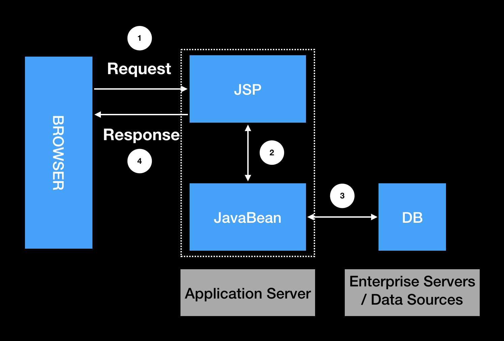
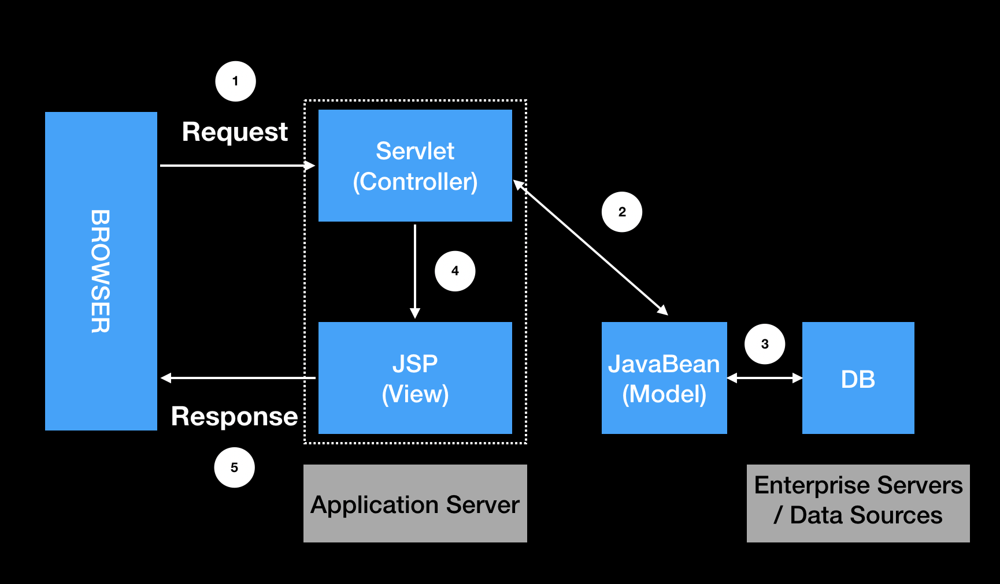
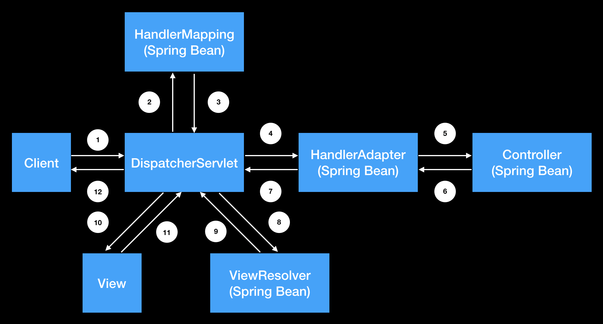

## MVC 1

- 동작과정
    1. 사용자 요청
    2. 비지니스 로직 수행
    3. DB 조작 or 조회
    4. 사용자 응답

- 장점
    - 단순하고 빠르게 구현 가능하다.

- 단점
    - 프론트엔드 코드와 백엔드 코드가 합쳐져 있어서 읽기 힘들다.
    - 유지보수하기 힘들다.
    - 역할 분리하기가 힘들다.

## MVC 2

- 동작 과정
    1. 사용자 요청
    2. 비지니스 로직 수행
    3. DB 조작 or 조회
    4. 뷰 선택
    5. 사용자 응답

- 장점
    - 유지보수하기가 좋다.
    - 역할을 분리할 수 있다. (프론트엔드, 백엔드)

- 단점
    - 설계하기 힘들고 시간이 많이 든다.

## Spring MVC

- 동작과정
    1. 사용자 요청
    2. 요청에 대한 Handler 유무 확인 및 데이터 매핑
    3. 요청에 대한 
    4. 개발자가 구현한 Handler 로 변환
    5. Handler 요청 수행
    6. Handler 결과 응답
    7. Handler 결과 ModelAndView 로 응답
    8. ModelAndView 요청
    9. 설정한 View 응답
    10. View render 요청
    11. View render 응답
    12. 사용자 응답