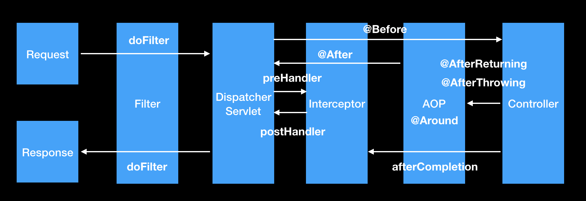

1. Request : 사용자 요청
2. doFilter : Dispatcher 앞 사용자 요청 처리
3. prehandler : Dispatcher 뒤 사용자 요청 처리
4. @Around : 해당 메서드 호출를 가로채서 처리
5. @Before : 메서드 호출 전 처리
6. @AfterReturning : Return 값 전달 전 처리
7. @After : 메서드 호출 후 처리
8. postHandler : Dispatcher 뒤 응답 처리
9. doFilter : Dispatcher 앞 응답 처리